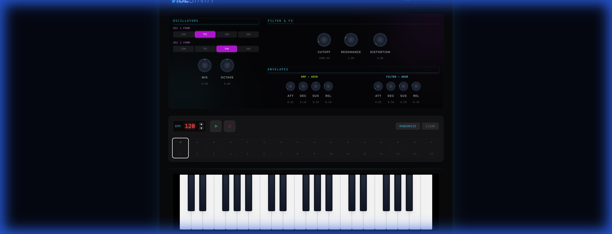
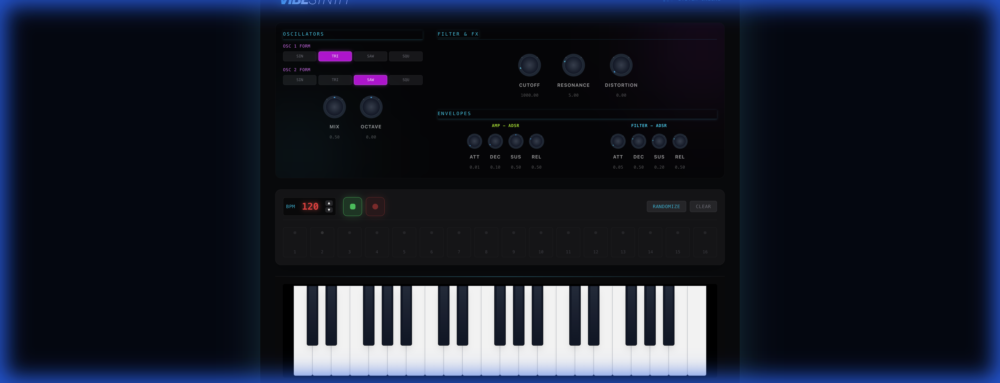

# VibeSynth 🎹



**VibeSynth** is a futuristic, cyberpunk-inspired web synthesizer built with **React**, **TypeScript**, and the **Web Audio API**. It features a 3-octave playable keyboard, a 16-step sequencer, and real-time audio effects like distortion and filter sweeps.

## ✨ Features

### 🎹 3-Octave Virtual Keyboard
- Ranges from **C3 to C6** (37 keys).
- Fully responsive design that fits perfectly on standard screens.
- **Mouse & Touch**: Click or drag across keys to play.
- **Keyboard Support**: Play the middle octave using your computer keyboard (`A` through `L` rows).

### 🎛️ 16-Step Sequencer
- **Pattern Creation**: Enable steps on a 16-step grid.
- **Live Recording**: Hit `Record` (Red Circle) and play keys to quantize notes into the sequence in real-time.
- **BPM Control**: Adjust tempo from **30 to 300 BPM** with a dedicated LED display.
- **Randomizer**: Instantly generate unique, evolving patterns with the click of a button.



### 🔊 Audio Engine & FX
- **Oscillators**: Powered by Web Audio API standard oscillators.
- **Distortion**: A dedicated **Dry/Wet Knob** (Red) adds grit and saturation to the sound.
- **Filter**: Resonant Low-Pass Filter with Cutoff and Resonance controls (Cyan/Fuchsia knobs).
- **Octave Shift**: Shift the entire keyboard range up or down by 3 octaves.

## 🛠️ Tech Stack

- **Frontend Framework**: React 18
- **Language**: TypeScript
- **Styling**: Tailwind CSS v4 (for that neon cyberpunk aesthetic)
- **Audio**: Native Web Audio API (No external sound libraries)
- **Build Tool**: Vite

## 🚀 Getting Started

### Prerequisites
- Node.js (v16 or higher)
- npm or yarn

### Installation

1. Clone the repository:
   ```bash
   git clone https://github.com/pavelzag/vibesynth.git
   cd vibesynth
   ```

2. Install dependencies:
   ```bash
   npm install
   ```

3. Start the development server:
   ```bash
   npm run dev
   ```

4. Open your browser at `http://localhost:5173` (or the port shown in terminal).

## 🎮 How to Play

1. **Play**: Click the keys or use your keyboard (`A`, `S`, `D`... for White keys, `W`, `E`... for Black keys).
2. **Shape Sound**:
   - Turn the **Cutoff** knob to open/close the filter.
   - Crank the **Distortion** knob for a heavier sound.
3. **Sequence**:
   - Set a **BPM**.
   - Click **Record** and **Play**.
   - Play some notes to capture a loop.
   - Use **Randomize** for instant inspiration.

## 📄 License

MIT License. Feel free to fork and vibe!
