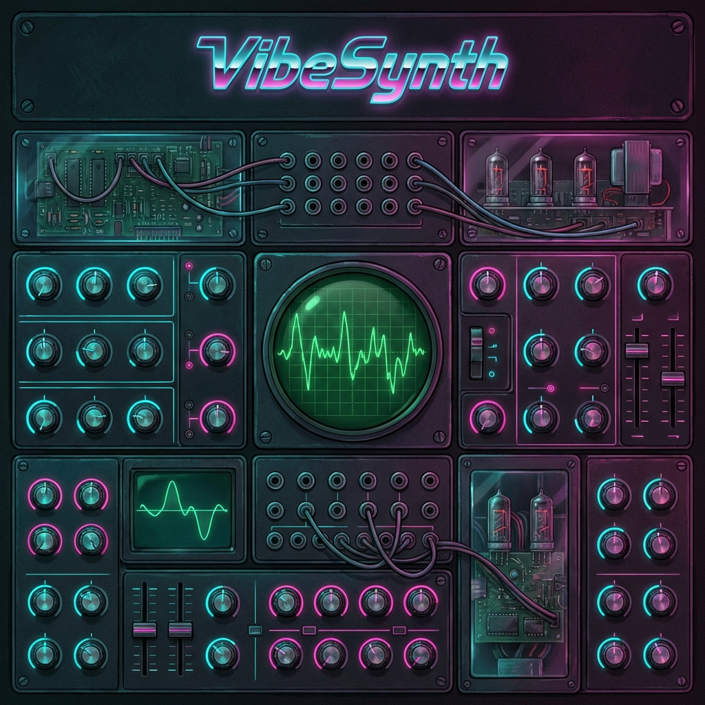

# VibeSynth 🎹



**VibeSynth** is a modern, retro-futuristic web synthesizer built with React, TypeScript, and the Web Audio API. It combines the warm, tactile feel of analog hardware with the flexibility of modern web technology.

## 🌟 Features

### 🔊 Dual Oscillator Engine
*   **Two Oscillators**: Blend between Sine, Triangle, Sawtooth, and Square waveforms.
*   **Mix Control**: Seamlessly crossfade between OSC 1 and OSC 2.
*   **Octave Shift**: Transpose your sound from deep bass (-3) to shimmering leads (+3).

### 🎛️ Analog-Modeled Filter
*   **Low Pass Filter**: Smoothes out the sound with a resonant peak.
*   **3 Ranges**:
    *   **BASS**: Optimized for deep sub-frequencies (20Hz - 800Hz).
    *   **LEAD**: Standard synth range (100Hz - 4kHz).
    *   **WIDE**: Full spectrum sweep (20Hz - 12kHz).
*   **Resonance Modes**: Switch between **Wait** (Clean), **Punch** (Aggressive), and **Scream** (Self-oscillating aesthetic).

### 📉 Envelopes (ADSR)
*   **Amp Envelope**: Shape the volume contour of your sound.
*   **Filter Envelope**: Modulate the filter cutoff over time.
    *   **Extended Attack**: Create evolving pads with up to 10 seconds of attack time.

### 🌊 Modulation (LFO)
*   **Routing**: Send LFO to **Filter Cutoff** or **Amplitude** (Tremolo).
*   **Ultra-Slow Rates**: LFO rates range from **0.01Hz** (100s cycle) for evolving textures to **20Hz** for rapid wobbles.
*   **Waveforms**: Sine, Triangle, Sawtooth, Square.

### 🌌 Effects
*   **Distortion**: Add grit and saturation to your signal.
*   **Reverb**: Place your sound in a **Room**, **Hall**, or deep **Space**.

### 🎲 Randomizer
*   **Instant Inspiration**: Click the "Randomize!" button to generate a completely new, musically-tuned patch instantly.

### 👁️ Visualizer
*   **Oscilloscope**: Real-time, CRT-style green phosphor waveform visualization.

## 🚀 Getting Started

### Prerequisites
*   Node.js (v16 or higher)
*   npm or yarn

### Installation

1.  Clone the repository:
    ```bash
    git clone https://github.com/pavelzag/vibesynth.git
    cd vibesynth
    ```

2.  Install dependencies:
    ```bash
    npm install
    ```

3.  Start the development server:
    ```bash
    npm run dev
    ```

4.  Open `http://localhost:5173` in your browser.

## 🎮 Controls

| Control | Description |
| :--- | :--- |
| **Piano** | Click keys or use your MIDI keyboard to play notes. |
| **Cutoff** | Brightness of the sound. |
| **Resonance** | "Ring" or sharpness of the filter peak. |
| **LFO Rate** | Speed of modulation. |
| **LFO Depth** | Intensity of modulation. |
| **Randomize** | Generates a random preset. |

## 🎹 MIDI Support
Connect any WebMIDI-compatible keyboard.
*   **Keys**: Play notes.
*   **CC 43**: Filter Cutoff.
*   **CC 44**: Resonance.
*   **CC 91**: Reverb Send.
*   **CC 24**: LFO Rate.
*   **CC 26**: LFO Depth.

## 👨‍💻 Credits

Created by **Pavel Zagalsky**.

Built with:
*   [React](https://reactjs.org/)
*   [Vite](https://vitejs.dev/)
*   [Tailwind CSS](https://tailwindcss.com/)
*   [Web Audio API](https://developer.mozilla.org/en-US/docs/Web/API/Web_Audio_API)

---
*System Online. VibeSynth v1.0*
